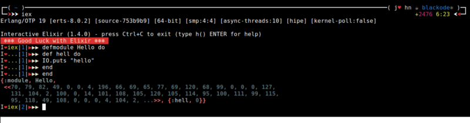

## 1. 多个 \[ OR \]

这是另外一种多个 **OR** 条件判断的写法，但这是一种不被推荐的方法。

因为常规的写法是当其中一个条件判断为 true，就会停止判断，不再执行后续的判断，这样能节省程序的执行时间；

而 Hack 方法需要将列表内的条件判断全部都执行，因此这个方法仅仅是提供一个启发而已。

```elixir
# 常规方法
find = fn(x) when x>10 or x<5 or x==7 -> x end 

# Hack 方法
hell = fn(x) when true in [x>10, x<5, x==7] -> x end
```

## 2. i\(term\) Elixir Term Type and Meta Data

在 `iex` 下使用 `i` 可以查看数据的类型以及相关信息，赶紧试试这个魔法吧。

```elixir
iex> i(1..5)
Term
  1..5
Data type
  Range
Description
  This is a struct. Structs are maps with a __struct__ key.
Reference modules
  Range, Map
Implemented protocols
  Enumerable, IEx.Info, Inspect
```

## 3. iex 自定义配置 - iex 装饰

将一下内容复制到你 home(`~`) 目录下的 `.iex.exs` 文件内，然后就是见证魔法的时刻了。 或者你可以从这里下载文件: [下载](https://gist.github.com/blackode/5728517116d7a4d08f0a4faddd8c145a)

```elixir
# IEx.configure colors: [enabled: true]
# IEx.configure colors: [ eval_result: [ :cyan, :bright ] ]
IO.puts IO.ANSI.red_background() <> IO.ANSI.white() <> " ❄❄❄ Good Luck with Elixir ❄❄❄ " <> IO.ANSI.reset
Application.put_env(:elixir, :ansi_enabled, true)
IEx.configure(
 colors: [
   eval_result: [:green, :bright] ,
   eval_error: [[:red,:bright,"Bug Bug ..!!"]],
   eval_info: [:yellow, :bright ],
 ],
 default_prompt: [
   "\e[G",    # ANSI CHA, move cursor to column 1
    :white,
    "I",
    :red,
    "❤" ,       # plain string
    :green,
    "%prefix",:white,"|",
     :blue,
     "%counter",
     :white,
     "|",
    :red,
    "▶" ,         # plain string
    :white,
    "▶▶"  ,       # plain string
      # ❤ ❤-»" ,  # plain string
    :reset
  ] |> IO.ANSI.format |> IO.chardata_to_string
)
```



## 4. 创建自定义魔符(Sigils)

每个 `x` 魔符(sigil) 分别用 `sigil_x` 来定义

定义

```elixir
defmodule MySigils do
  # 返回小写的字符串，如果包含选项 l 则会返回小写的字母列表
  def sigil_l(string,[]), do: String.downcase(string)
  def sigil_l(string,[?l]), do: String.downcase(string) |> String.graphemes

  # 返回大写的字符串，如果包含选项 l 则会返回大写的字母列表
  def sigil_u(string,[]), do: String.upcase(string)
  def sigil_u(string,[?l]), do: String.upcase(string) |> String.graphemes
end
```

**使用**

在 `iex`中加载该模块

```elixir
iex> import MySigils
iex> ~l/HELLO/
"hello"
iex> ~l/HELLO/l
["h", "e", "l", "l", "o"]
iex> ~u/hello/
"HELLO"
iex> ~u/hello/l
["H", "E", "L", "L", "O"]
```

## 5. 自定义 错误类型

### 定义 错误类型

```elixir
defmodule BugError do
   defexception message: "BUG BUG .." # 默认的错误信息
end
```

**使用**

```elixir
$ iex bug_error.ex
iex> raise BugError
** (BugError) BUG BUG ..
iex> raise BugError, message: "I am Bug.." # 动态定义错误信息
** (BugError) I am Bug..
```

## 6. 从嵌套 Map 结构中的获取值的简便方法

`get_in` 方法只需要 键(key) 列表即可轻易获得嵌套 Map 结构中对应的值

```elixir
nested_map = %{ name: %{ first_name: "blackode"} }     # 嵌套 Map 结构示例
first_name = get_in(nested_map, [:name, :first_name])  # 获取对应 键(key) 的值

# Returns nil for missing value 
nil = get_in(nested_map, [:name, :last_name])          # 当 键(key) 不存在时返回 nil
```

查看文档: [Kernel.get\_in/2](http://elixir-lang.org/docs/stable/elixir/Kernel.html#get_in/2)

## 7. With 声明的好处

`with` 语法通常用于按顺序执行一系列的匹配，如果所有的分支都匹配，则返回 `do:` 的结果；但是，如果其中一个分支没有匹配，则返回不匹配的表达式的执行结果。

```elixir
iex> with 1 <- 1+0,
          2 <- 1+1,
          do: IO.puts "all matched"
"all matched"
```

```elixir
iex> with 1 <- 1+0,
          2 <- 3+1,
          do: IO.puts "all matched"
4
## since  2 <- 3+1 is not matched so the result of 3+1 is returned
```

## 8. 使用协议

### 定义一个协议

**协议**是一种根据参数类型将函数分派到特定实现的方式. `defprotocol` 宏是用来定义协议， `defimpl` 宏可以分别给不同的类型定义协议实现，看下面的列子：

```elixir
defprotocol Triple do    
  def triple(input)  
end  

defimpl Triple, for: Integer do    
  def triple(int) do     
    int * 3   
  end  
end   

defimpl Triple, for: List do
  def triple(list) do
    list ++ list ++ list   
  end  
end
```

**使用**

记载代码到  `iex`  并执行

```elixir
iex> Triple.triple(3) 
9
Triple.triple([1, 2])
[1, 2, 1, 2, 1, 2]
```

## 9. 条件运算符

在 Elixir 中没有 `true ? "yes" : "no"` 这种语法. 所以, 建议你这样写.

```elixir
"no" = if 1 == 0, do: "yes", else: "no"
```

## 10. Kernel.\|\| 的优势

当我们使用管道(|>)时, 有时候 `or` 的操作会破坏掉管道的连续. 例如:

```elixir
result = :input
|> do_something
|> do_another_thing
```

```text
# Bad
result = (result || :default_output)
|> do_something_else
```

如上所示, `||` 只是 `Kernel.||` 的缩写而已 . 使用 `Kernel.||` 来代替，可以避免管道的连续被破坏掉.

上面的代码可以改成这样:

```elixir
result = :input
|> do_something
|> do_another_thing
|> Kernel.||(:default_output)  #<-- 这里
|> do_something_else
```

这个技巧由 [qhwa](https://medium.com/@qhwa_85848) 提出

[下一篇](part2.md)
