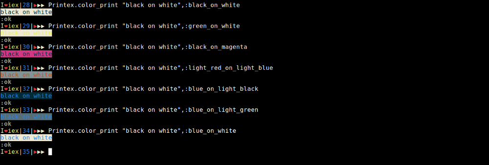

## **1  代码分组**

代码分组非常有用；在不使用大括号的情况下，在单行中编写多行代码时，它能帮组你了解代码是如何分组的；下面这个例子会更清楚地说明这一点。

```elixir
one 1 |> two()
```

需要查看代码是如何分组的，可以这样做：

```elixir
quote(do: one 1 |> two()) |> Macro.to_string |> IO.puts
one(1 |> two())
```

所以，依赖于 `quote` 和 `Macro.to_string` 的功能，我们能很方便的看到分组后的代码。

这个技巧来源于 **Ecto** 的创建者 [**MichalMuskala**](https://elixirforum.com/users/michalmuskala) 在 Elixir forum 的讨论。

## 2  Elixir 的短路运算符 && — \|\|

这个技巧可以取代复杂的嵌套条件判断，同时也是我在处理复杂比较的情况下最好的朋友。相信我，你会爱上这个技巧。

`||` 运算符总是返回第一个比较直为 true 的表达式的值。不再关心剩余的表达式，也不会再执行它们。

### \|\|

```elixir
false || nil || :blackode || :elixir || :jose
```

从上面的例子可以看出，在 Elixir 中 false 和 `nil` 都被判定为 false，而 `:blackode` 被判定 true 并且这个值会作为返回值，剩下的 :elixir` 和 `:jose` 将不会再执行。  另外，如果所有表达式都被判定为`false` 则最后一个表达式的值将会作为返回值。

### &&

```elixir
iex> true && :true && :elixir && 5
5
iex> nil && 100
nil
iex> salary = is_login && is_admin && is_staff && 100_000
```

`&&` 当第一个表达式的值被评估为 `true` 之后，返回第二个表达式的值；如果第一个表达式被评估为 `false` 则会直接返回，并且不会再执行第二个表达式。上面例子中的最后一条，是我们通常使用 `&&` 的情况。

## 3  比较两个不同类型的数据

我对此有亲身经历，当我还是 Elixir 初学者的时候，我在不知情的情况下进行了 `"5" > 4` 的比较，令我惊讶的是，居然返回了 `true`.

在 **Elixir** 中，不同类型的数据是可以相互比较的，所以在比较时一定要小心。

Try this:

```elixir
iex> x = "I am x "
"I am x "
iex> x > 34
true
iex> x > [1,2,3]
true
iex> [1,2,3] < 1234567890
false
```

**不同类型的比较顺序**

> number &lt; atom &lt; reference &lt; fun &lt; port &lt; pid &lt; tuple &lt; map &lt; list &lt; bitstring \(binary\)

## 4  使用算数运算符作为匿名函数

当我第一次看到这种用法时，我对自己说 “**Elixir真疯狂**”。这个提示非常好用，而且能节省大量的开发时间， Elixir 中的所有操作符都是宏。所以，我们可以以匿名函数的方式来使用他们。

```elixir
iex> Enum.reduce([1,2,3], 0, &+/2)
6
iex> Enum.reduce([1,2,3], 0, &*/2)
0
iex> Enum.reduce([1,2,3], 3, &*/2)
18
iex> Enum.reduce([1,2,3], 3, &-/2)
-1
iex> Enum.reduce([1,2,3], 3, &//2)
0.5
```

## 5  Binary 模式匹配

这是我最近的一个新发现。我总是遇到一个像 `"$34.56"` 的字符串，需要转换为数字进行算术运算。在了解 Binary 的模式匹配之前，我是这样操作的：

```elixir
iex> value = "$34.56"
iex ...      |> String.split("$")
iex ...      |> tl
iex ...      |> List.first
iex ...      |> String.to_float
34.56
```

### 建议方法

```elixir
iex> "$" <> value = "$34.56"
"$34.56"
iex> String.to_float value  
34.56
```

这个新方法实在太便捷了，我最近也将这种方法应用到新项目上。

## 6  重新编译项目

在我作为初学者的阶段的时候，每当我修改完文件，需要重新编译，我都会先退出控制台，然后再重新进入。如果你也是这样，请立刻停止，你可以直接在控制台重新编译项目。

```elixir
$ iex -S mix
iex> recompile
```

**警告:** 变更 `config/config.ex` 文件不会重新加载，这种情况必须重启控制台。

## 7  日志模块

Logger 模块是常用的模块之一，它默认会与你的应用一起启动。调用前只需要 `require Logger` 即可。 当我还是一个 Elixir 新手时，我经常用这种方式： `IO.puts "This is value of data"`，在控制台打印输出去调试问题，但是这种方式有一个很大的弊端，输出的内容会相互混在一起，以至于很难分辨彼此。

`Logger` 的方式解决了这个问题。它支持很多功能，但我经常用 `warn` `info` 和 `error` 三种定义，每个定义的打印 **颜色**是不一样的，因此在查看输出的时候可以一目了然分辨出每一条内容。

另外打印的时候会与**时间**一同输出，这样你就可以知道你的程序是什么时候被执行的。所以，你可以很清晰地了解到程序执行的流程。

在使用 `Logger` 模块前，必须先 `require Logger`，这样所有的宏会加载到当前模块中。

Try this:

```elixir
iex> require Logger
Logger
iex> Logger.info "This is the info"
15:04:33.102 [info]  This is the info
:ok
iex> Logger.warn "This is warning"
15:04:56.712 [warn]  This is warning
:ok
iex> Logger.error "This is error"
15:05:19.570 [error] This is error
:ok
```

这个技巧来源于 [Anwesh Reddy](https://medium.com/@kanishkablack)

## 8  查看所有已经启动的应用

我们可以检查与我们的应用程序一起启动的所有应用程序。有时我们必须检查某个特定的应用程序是否已启动。所以，在那些情况下它会帮助你。如果你是初学者，你会觉得这个技巧不会经常用到。但我非常肯定，当你使用多个应用程序时，这个技巧将非常有用。

```elixir
iex> Application.started_applications
[{:logger, 'logger', '1.4.0'}, {:iex, 'iex', '1.4.0'},
 {:elixir, 'elixir', '1.4.0'}, {:compiler, 'ERTS  CXC 138 10', '7.0.1'},
 {:stdlib, 'ERTS  CXC 138 10', '3.0.1'}, {:kernel, 'ERTS  CXC 138 10', '5.0.1'}]
```

## 9  使用 :atoms / binary\(strings\) 作为 Map 的键的优势

在你了解这个技巧前，我必须告诉你，**原子(:atoms)** 是不参与 GC(garbage collected) 的。

Atom 作为键是非常好用的！如果你在你的代码中都如数定义了这些原子(atom)，这样不会有问题。在处理用户提供的输入时，应该先进行特殊处理，不能直接将其转换为原子，否则将会导致系统内存不足。**如果代码中存在动态创建原子的情况，你应该小心。**

使用原子(atom)键可以用`map.key`的方式从`map`中检索数据，常规的方式是 `map["key"]`，前者相对于后者省去了很多输入上的麻烦，但我不鼓励这样做，因为作为程序员，我们更应该关心内存问题。

Try this:

```elixir
iex> map = %{name: "blackode", blog: "medium"}
%{blog: "medium", name: "blackode"}
iex> map.name
"blackode"
iex> map.blog
"medium"
```

在使用 `map.key` 的方式检索数据时，必须确保 `key` 存在于  `map` 中，否者会引发 **key error** 错误，而 `map["key"]` 方式在`key`不存在时会返回 `nil`。

```elixir
iex> map["age"]
nil
```

```text
iex> map.age
Bug Bug ..!!** (KeyError) key :age not found in: %{blog: "medium", name: "blackode"}
Bug Bug ..!!
```

## 10 彩色打印

Elixir `>=1.4.0` 的控制台支持 **ANSI** 彩色打印开关；你可以用颜色玩出很多花样来。你甚至可以指定 **背景颜色**.

```elixir
iex> import IO.ANSI
iex> IO.puts red <> "red" <> green <> " green" <> yellow <> " yellow" <> reset <> " normal"
iex> IO.puts Enum.join [red, "red", green, " green", yellow, " yellow", reset, " normal"]
red green yellow normal
```

red 印成红色，green 印成绿色，yellow 印成黄色， normal 印成白色。用颜色可以创造更多乐趣…

有关彩色打印的更多详细信息，可以看看这个库： [**Printex**](https://github.com/blackode/printex) ，这是为了更多乐趣创造出来的。

Try This:



[前一篇](part1.md) [下一篇](part3.md)
